# Fluxo dos Agentes — Juiz e Pesquisador (provisório)

> **Página provisória.** Explica em diagramas o que o Agente Juiz (issue #19, PR #36, já na `main`) entrega, como o backend funciona hoje e como deve ficar quando o Agente Pesquisador entrar na esteira. Retrato de 05/10/2026, depois do merge do PR #36. Quando a esteira estiver integrada, o conteúdo útil migra para a página [Arquitetura](/pages/arquitetura.md).

**Legenda usada nos diagramas**

- 🟩 **Verde:** existe e está testado no código.
- 🟦 **Azul:** recém-entregue (Agente Juiz, PR #36).
- 🟨 **Amarelo:** existe, mas ainda é mock ou não está ligado à esteira.
- ⬜ **Cinza tracejado:** planejado; o arquivo existe vazio ou nem existe.

---

## 1. Panorama: o que existe hoje

O backend já tem as peças de baixo (camada de LLM, cliente da OpenAlex, Triador e agora o Juiz), mas **nenhuma delas está ligada à rota `/verificar`**, que continua devolvendo um veredito fixo. Os arquivos `pesquisador.py`, `cache.py` e `bertopic_nlp.py` existem, mas estão vazios.

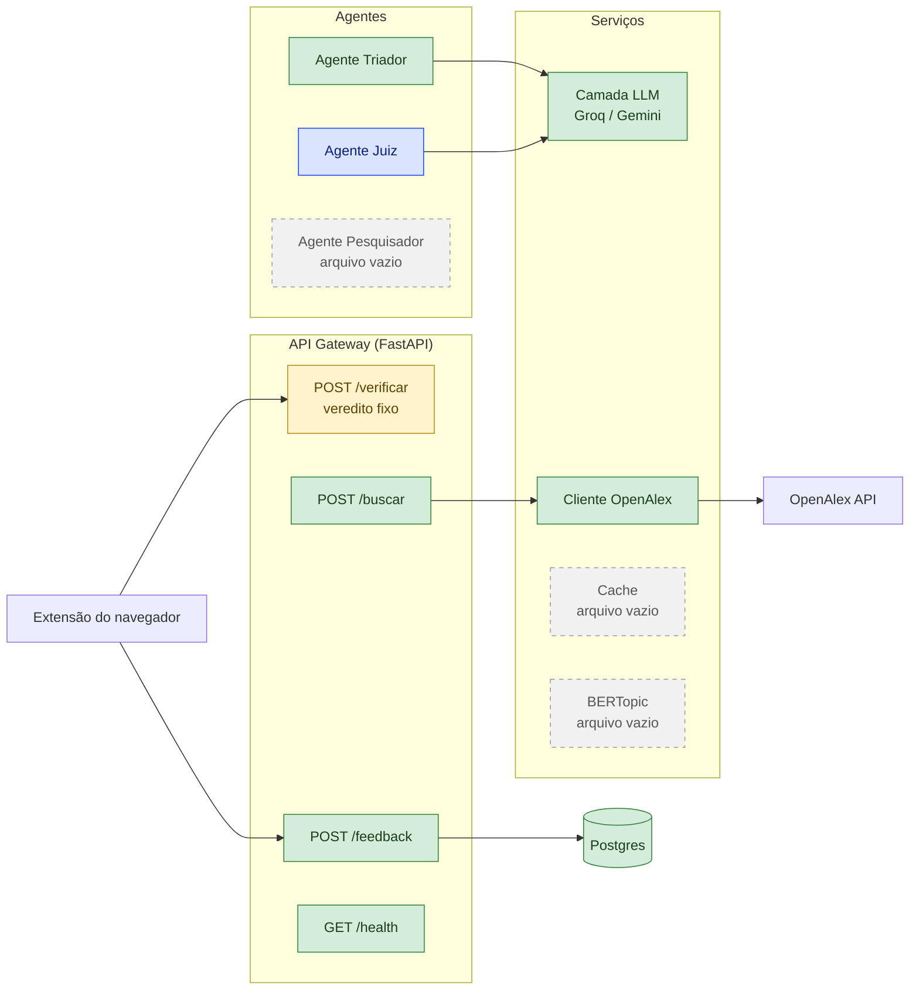
```mermaid
flowchart LR
    EXT["Extensão do navegador"]

    subgraph GW["API Gateway (FastAPI)"]
        VER["POST /verificar<br/>veredito fixo"]
        BUS["POST /buscar"]
        FB["POST /feedback"]
        HLT["GET /health"]
    end

    subgraph AG["Agentes"]
        TRI["Agente Triador"]
        JUI["Agente Juiz"]
        PES["Agente Pesquisador<br/>arquivo vazio"]
    end

    subgraph SV["Serviços"]
        LLM["Camada LLM<br/>Groq / Gemini"]
        OA["Cliente OpenAlex"]
        CACHE["Cache<br/>arquivo vazio"]
        BERT["BERTopic<br/>arquivo vazio"]
    end

    PG[("Postgres")]
    OAAPI["OpenAlex API"]

    EXT --> VER
    EXT --> FB
    BUS --> OA --> OAAPI
    FB --> PG
    TRI --> LLM
    JUI --> LLM

    classDef ok fill:#d4edda,stroke:#2e7d32,color:#1b3d1f
    classDef novo fill:#dbe4ff,stroke:#183FFF,color:#0b1f80
    classDef mock fill:#fff3cd,stroke:#b8860b,color:#5c4300
    classDef plano fill:#f1f1f1,stroke:#999,stroke-dasharray:5 5,color:#555

    class BUS,FB,HLT,TRI,LLM,OA,PG ok
    class JUI novo
    class VER mock
    class PES,CACHE,BERT plano
```

| Peça | Arquivo | Situação |
| :--- | :--- | :--- |
| Rota de verificação | `src/api/gateway/routes.py` | Mock: devolve sempre o mesmo veredito |
| Busca crua | `POST /buscar` → `src/services/openalex.py` | Funciona, sem LLM |
| Camada de LLM | `src/services/llm.py` | Funciona: timeout, nova tentativa, validação por schema |
| Agente Triador | `src/agents/triador.py` | Funciona isolado, com eval próprio |
| **Agente Juiz** | `src/agents/juiz.py` | **Recém-entregue (PR #36)**, funciona isolado |
| Agente Pesquisador | `src/agents/pesquisador.py` | Vazio |
| Cache e BERTopic | `src/services/cache.py`, `bertopic_nlp.py` | Vazios |

---

## 2. Como o fluxo funciona hoje

### 2.1 O que a extensão vê: `POST /verificar`

A extensão recebe sempre o mesmo veredito fixo. Nenhum agente é chamado.

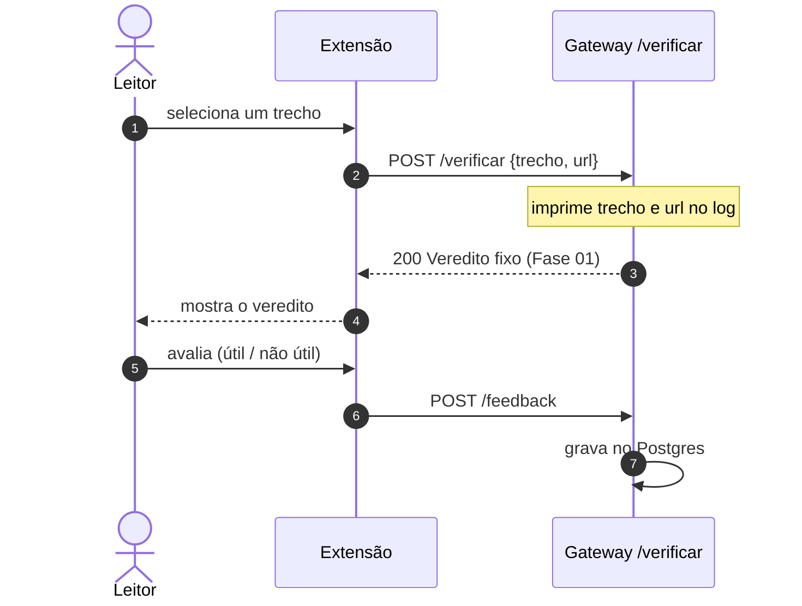
```mermaid
sequenceDiagram
    autonumber
    actor U as Leitor
    participant E as Extensão
    participant G as Gateway /verificar

    U->>E: seleciona um trecho
    E->>G: POST /verificar {trecho, url}
    Note over G: imprime trecho e url no log
    G-->>E: 200 Veredito fixo (Fase 01)
    E-->>U: mostra o veredito
    U->>E: avalia (útil / não útil)
    E->>G: POST /feedback
    G->>G: grava no Postgres
```

### 2.2 A busca que já funciona: `POST /buscar`

Esta rota é usada para teste e depuração. Recebe strings de busca prontas e devolve os trabalhos da OpenAlex, sem Triador e sem Juiz.

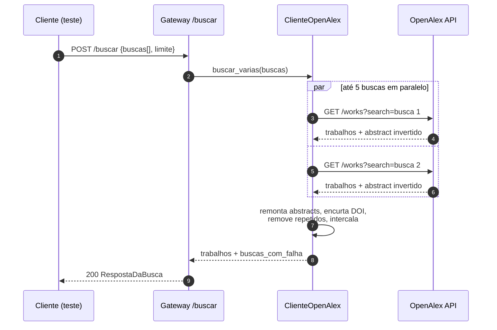
```mermaid
sequenceDiagram
    autonumber
    participant C as Cliente (teste)
    participant G as Gateway /buscar
    participant O as ClienteOpenAlex
    participant A as OpenAlex API

    C->>G: POST /buscar {buscas[], limite}
    G->>O: buscar_varias(buscas)
    par até 5 buscas em paralelo
        O->>A: GET /works?search=busca 1
        A-->>O: trabalhos + abstract invertido
    and
        O->>A: GET /works?search=busca 2
        A-->>O: trabalhos + abstract invertido
    end
    O->>O: remonta abstracts, encurta DOI,<br/>remove repetidos, intercala
    O-->>G: trabalhos + buscas_com_falha
    G-->>C: 200 RespostaDaBusca
```

### 2.3 Agente Triador (feature 018, já na main)

O Triador transforma o trecho em português em strings de busca em inglês. O LLM só extrai os conceitos; o resto é determinístico (glossário + eixos de combinação). Se o LLM falhar, o Triador segue com o trecho original em vez de quebrar.

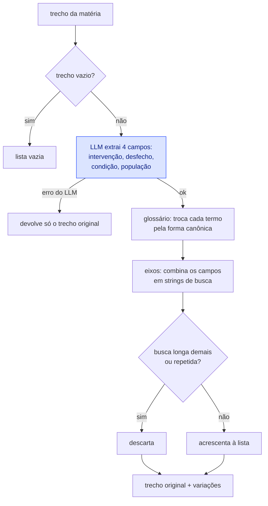
```mermaid
flowchart TD
    A["trecho da matéria"] --> B{"trecho vazio?"}
    B -- sim --> Z1["lista vazia"]
    B -- não --> C["LLM extrai 4 campos:<br/>intervenção, desfecho,<br/>condição, população"]
    C -- "erro do LLM" --> Z2["devolve só o trecho original"]
    C -- ok --> D["glossário: troca cada termo<br/>pela forma canônica"]
    D --> E["eixos: combina os campos<br/>em strings de busca"]
    E --> F{"busca longa demais<br/>ou repetida?"}
    F -- sim --> G["descarta"]
    F -- não --> H["acrescenta à lista"]
    G --> I["trecho original + variações"]
    H --> I

    classDef llm fill:#dbe4ff,stroke:#183FFF,color:#0b1f80
    class C llm
```

---

## 3. O que a feature 019 (Agente Juiz) entrega

Seis commits de Bruno Ricardo de Menezes (os três últimos com coautoria de Breno Fernandes), integrados à `main` pelo PR #36: cerca de 1.550 linhas em 13 arquivos.

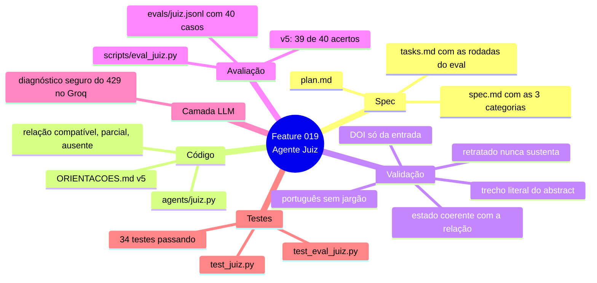
```mermaid
mindmap
  root((Feature 019<br/>Agente Juiz))
    Spec
      spec.md com as 3 categorias
      plan.md
      tasks.md com as rodadas do eval
    Código
      agents/juiz.py
      ORIENTACOES.md v5
      relação compatível, parcial, ausente
    Validação
      estado coerente com a relação
      DOI só da entrada
      retratado nunca sustenta
      trecho literal do abstract
      português sem jargão
    Avaliação
      evals/juiz.jsonl com 40 casos
      scripts/eval_juiz.py
      v5: 39 de 40 acertos
    Camada LLM
      diagnóstico seguro do 429 no Groq
    Testes
      test_juiz.py
      test_eval_juiz.py
      34 testes passando
```

### 3.1 As três categorias: como o Juiz deve decidir

Esta é a regra que o prompt ensina ao LLM, conforme a seção 3 da spec. O código não refaz esse raciocínio, mas **garante as bordas**: retratado e DOI inventado são barrados mesmo que o LLM erre.

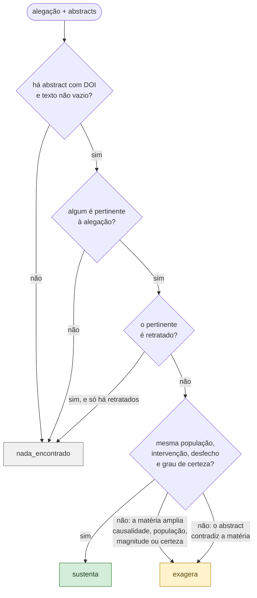
```mermaid
flowchart TD
    S(["alegação + abstracts"]) --> A{"há abstract com DOI<br/>e texto não vazio?"}
    A -- não --> N["nada_encontrado"]
    A -- sim --> B{"algum é pertinente<br/>à alegação?"}
    B -- não --> N
    B -- sim --> C{"o pertinente<br/>é retratado?"}
    C -- "sim, e só há retratados" --> N
    C -- não --> D{"mesma população,<br/>intervenção, desfecho<br/>e grau de certeza?"}
    D -- sim --> SU["sustenta"]
    D -- "não: a matéria amplia<br/>causalidade, população,<br/>magnitude ou certeza" --> EX["exagera"]
    D -- "não: o abstract<br/>contradiz a matéria" --> EX

    classDef su fill:#d4edda,stroke:#2e7d32,color:#1b3d1f
    classDef ex fill:#fff3cd,stroke:#b8860b,color:#5c4300
    classDef nd fill:#f1f1f1,stroke:#777,color:#333
    class SU su
    class EX ex
    class N nd
```

Exemplos típicos de `exagera`: o estudo mostra **associação** e a matéria fala em **causa**; o estudo foi em **camundongos** e a matéria fala em **pessoas**; o estudo diz "reduziu o risco" e a matéria diz "cura".

#### Decisão em duas etapas (prompt v5)

Nas primeiras rodadas do eval, o LLM confundia "o estudo não prova a frase inteira" com "não há estudo nenhum", e respondia `nada_encontrado` onde o certo era `exagera`. A correção foi obrigar o modelo a declarar primeiro a **relação** entre alegação e abstract e só depois o estado. O código confere se os dois combinam.

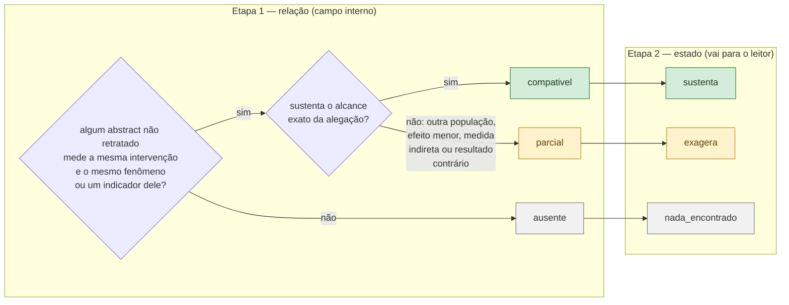
```mermaid
flowchart LR
    subgraph E1["Etapa 1 — relação (campo interno)"]
        direction TB
        Q{"algum abstract não retratado<br/>mede a mesma intervenção<br/>e o mesmo fenômeno<br/>ou um indicador dele?"}
        Q -- não --> AU["ausente"]
        Q -- sim --> Q2{"sustenta o alcance<br/>exato da alegação?"}
        Q2 -- sim --> CO["compativel"]
        Q2 -- "não: outra população,<br/>efeito menor, medida<br/>indireta ou resultado<br/>contrário" --> PA["parcial"]
    end
    subgraph E2["Etapa 2 — estado (vai para o leitor)"]
        direction TB
        SU2["sustenta"]
        EX2["exagera"]
        ND2["nada_encontrado"]
    end
    CO --> SU2
    PA --> EX2
    AU --> ND2

    classDef su fill:#d4edda,stroke:#2e7d32,color:#1b3d1f
    classDef ex fill:#fff3cd,stroke:#b8860b,color:#5c4300
    classDef nd fill:#f1f1f1,stroke:#777,color:#333
    class CO,SU2 su
    class PA,EX2 ex
    class AU,ND2 nd
```

O campo `relacao` **não sai do backend**: o contrato com a extensão (`Veredito`) continua igual. Exemplo do próprio prompt: um filtro que reduziu parte das partículas em teste de bancada é `parcial` → `exagera` diante da alegação "elimina toda a poluição da casa"; um estudo sobre duração de baterias seria `ausente` → `nada_encontrado`.

### 3.2 Fluxo interno do `AgenteJuiz.julgar`

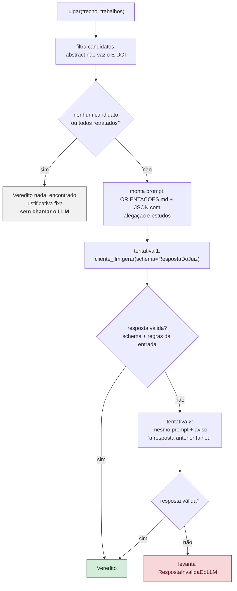
```mermaid
flowchart TD
    A["julgar(trecho, trabalhos)"] --> B["filtra candidatos:<br/>abstract não vazio E DOI"]
    B --> C{"nenhum candidato<br/>ou todos retratados?"}
    C -- sim --> R0["Veredito nada_encontrado<br/>justificativa fixa<br/><b>sem chamar o LLM</b>"]
    C -- não --> D["monta prompt:<br/>ORIENTACOES.md + JSON com<br/>alegação e estudos"]
    D --> E["tentativa 1:<br/>cliente_llm.gerar(schema=RespostaDoJuiz)"]
    E --> F{"resposta válida?<br/>schema + regras da entrada"}
    F -- sim --> OK["Veredito"]
    F -- não --> G["tentativa 2:<br/>mesmo prompt + aviso<br/>'a resposta anterior falhou'"]
    G --> H{"resposta válida?"}
    H -- sim --> OK
    H -- não --> ERR["levanta RespostaInvalidaDoLLM"]

    classDef ok fill:#d4edda,stroke:#2e7d32,color:#1b3d1f
    classDef err fill:#f8d7da,stroke:#b02a37,color:#58151c
    classDef nd fill:#f1f1f1,stroke:#777,color:#333
    class OK ok
    class ERR err
    class R0 nd
```

### 3.3 Sequência de uma chamada com nova tentativa

São duas camadas de repetição diferentes. A **camada LLM** repete falhas de rede e de provedor (timeout, 429, 5xx). O **Juiz** repete uma vez quando a resposta chega, mas não passa nas regras dele.

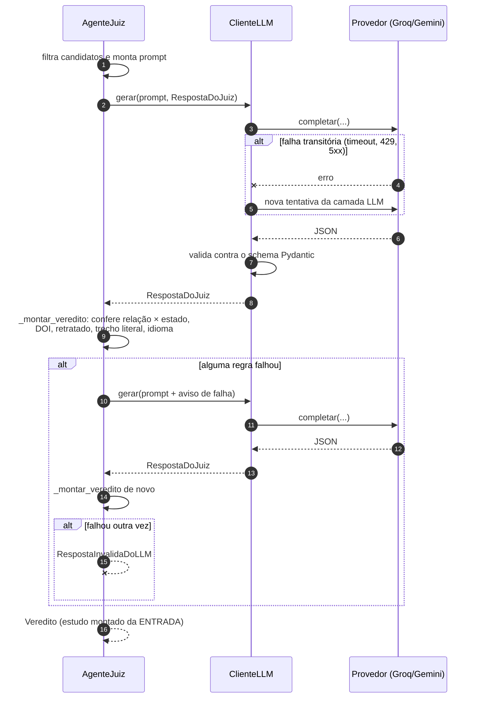
```mermaid
sequenceDiagram
    autonumber
    participant J as AgenteJuiz
    participant C as ClienteLLM
    participant P as Provedor (Groq/Gemini)

    J->>J: filtra candidatos e monta prompt
    J->>C: gerar(prompt, RespostaDoJuiz)
    C->>P: completar(...)
    alt falha transitória (timeout, 429, 5xx)
        P--xC: erro
        C->>P: nova tentativa da camada LLM
    end
    P-->>C: JSON
    C->>C: valida contra o schema Pydantic
    C-->>J: RespostaDoJuiz
    J->>J: _montar_veredito: confere relação × estado,<br/>DOI, retratado, trecho literal, idioma
    alt alguma regra falhou
        J->>C: gerar(prompt + aviso de falha)
        C->>P: completar(...)
        P-->>C: JSON
        C-->>J: RespostaDoJuiz
        J->>J: _montar_veredito de novo
        alt falhou outra vez
            J--xJ: RespostaInvalidaDoLLM
        end
    end
    J-->>J: Veredito (estudo montado da ENTRADA)
```

### 3.4 Árvore de validação da resposta (`_montar_veredito`)

Cada losango é uma verificação **determinística** no código. Qualquer "não" vira `RespostaInvalidaDoLLM` e consome a nova tentativa.

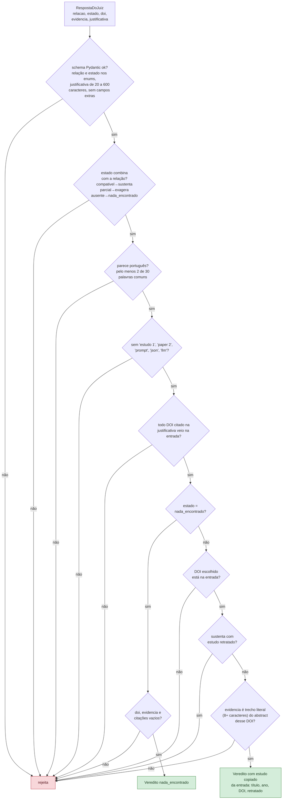
```mermaid
flowchart TD
    A["RespostaDoJuiz<br/>relacao, estado, doi,<br/>evidencia, justificativa"] --> P0{"schema Pydantic ok?<br/>relação e estado nos enums,<br/>justificativa de 20 a 600<br/>caracteres, sem campos extras"}
    P0 -- não --> X["rejeita"]
    P0 -- sim --> PR{"estado combina<br/>com a relação?<br/>compativel→sustenta<br/>parcial→exagera<br/>ausente→nada_encontrado"}
    PR -- não --> X
    PR -- sim --> P1{"parece português?<br/>pelo menos 2 de 30<br/>palavras comuns"}
    P1 -- não --> X
    P1 -- sim --> P2{"sem 'estudo 1', 'paper 2',<br/>'prompt', 'json', 'llm'?"}
    P2 -- não --> X
    P2 -- sim --> P3{"todo DOI citado na<br/>justificativa veio na entrada?"}
    P3 -- não --> X
    P3 -- sim --> P4{"estado =<br/>nada_encontrado?"}
    P4 -- sim --> P5{"doi, evidencia e<br/>citações vazios?"}
    P5 -- não --> X
    P5 -- sim --> V0["Veredito nada_encontrado"]
    P4 -- não --> P6{"DOI escolhido<br/>está na entrada?"}
    P6 -- não --> X
    P6 -- sim --> P7{"sustenta com<br/>estudo retratado?"}
    P7 -- sim --> X
    P7 -- não --> P8{"evidencia é trecho literal<br/>(8+ caracteres) do abstract<br/>desse DOI?"}
    P8 -- não --> X
    P8 -- sim --> V1["Veredito com estudo copiado<br/>da entrada: título, ano, DOI, retratado"]

    classDef ok fill:#d4edda,stroke:#2e7d32,color:#1b3d1f
    classDef err fill:#f8d7da,stroke:#b02a37,color:#58151c
    class V0,V1 ok
    class X err
```

> **O que mudou em relação à primeira versão:** entrou a checagem relação × estado; a justificativa **não precisa mais** citar o DOI escolhido (se citar algum DOI, ele tem de ter vindo na entrada); e a lista de palavras usada para reconhecer português passou de 18 para 30, reduzindo rejeições indevidas.

> **Por que o `estudo` vem da entrada e não do LLM?** O modelo só escolhe **qual** DOI. Título, ano e retratação são copiados do trabalho que a OpenAlex devolveu, então um título ou ano inventado nunca chega ao leitor.

### 3.5 Ciclo de vida de uma chamada ao Juiz

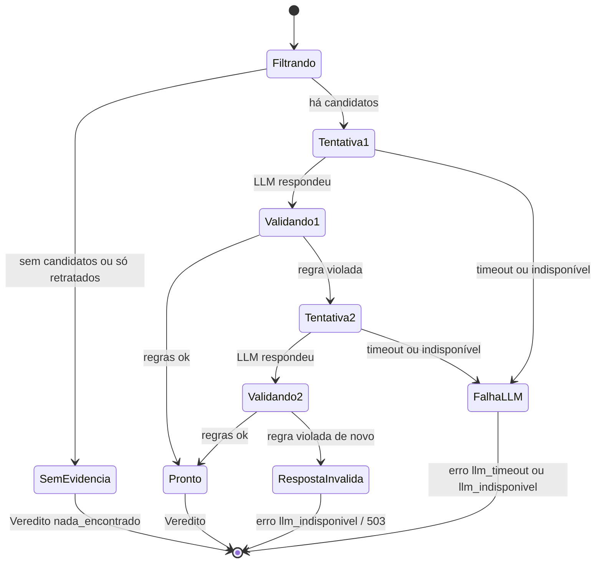
```mermaid
stateDiagram-v2
    [*] --> Filtrando
    Filtrando --> SemEvidencia: sem candidatos ou só retratados
    Filtrando --> Tentativa1: há candidatos
    Tentativa1 --> Validando1: LLM respondeu
    Tentativa1 --> FalhaLLM: timeout ou indisponível
    Validando1 --> Pronto: regras ok
    Validando1 --> Tentativa2: regra violada
    Tentativa2 --> Validando2: LLM respondeu
    Tentativa2 --> FalhaLLM: timeout ou indisponível
    Validando2 --> Pronto: regras ok
    Validando2 --> RespostaInvalida: regra violada de novo
    SemEvidencia --> [*]: Veredito nada_encontrado
    Pronto --> [*]: Veredito
    RespostaInvalida --> [*]: erro llm_indisponivel / 503
    FalhaLLM --> [*]: erro llm_timeout ou llm_indisponivel
```

### 3.6 Modelo de dados envolvido

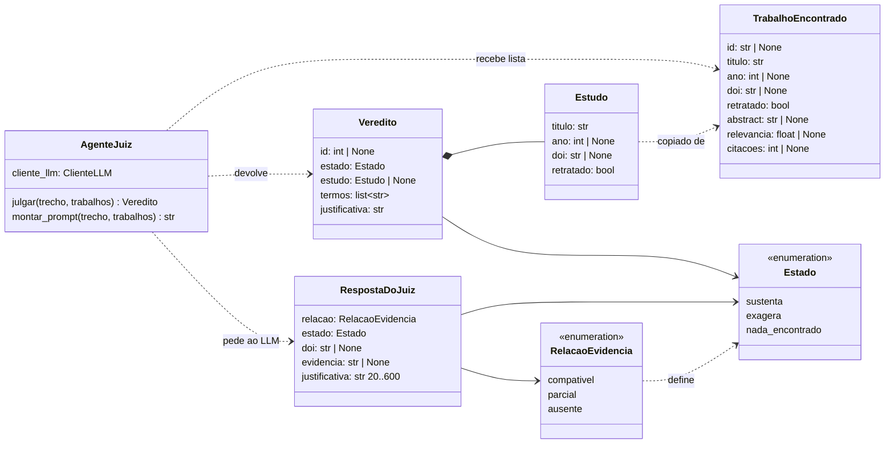
```mermaid
classDiagram
    direction LR
    class TrabalhoEncontrado {
        id: str | None
        titulo: str
        ano: int | None
        doi: str | None
        retratado: bool
        abstract: str | None
        relevancia: float | None
        citacoes: int | None
    }
    class RespostaDoJuiz {
        relacao: RelacaoEvidencia
        estado: Estado
        doi: str | None
        evidencia: str | None
        justificativa: str 20..600
    }
    class Veredito {
        id: int | None
        estado: Estado
        estudo: Estudo | None
        termos: list~str~
        justificativa: str
    }
    class Estudo {
        titulo: str
        ano: int | None
        doi: str | None
        retratado: bool
    }
    class Estado {
        <<enumeration>>
        sustenta
        exagera
        nada_encontrado
    }
    class RelacaoEvidencia {
        <<enumeration>>
        compativel
        parcial
        ausente
    }
    class AgenteJuiz {
        cliente_llm: ClienteLLM
        julgar(trecho, trabalhos) Veredito
        montar_prompt(trecho, trabalhos) str
    }

    AgenteJuiz ..> TrabalhoEncontrado : recebe lista
    AgenteJuiz ..> RespostaDoJuiz : pede ao LLM
    AgenteJuiz ..> Veredito : devolve
    Veredito *-- Estudo
    Veredito --> Estado
    RespostaDoJuiz --> Estado
    RespostaDoJuiz --> RelacaoEvidencia
    RelacaoEvidencia ..> Estado : define
    Estudo ..> TrabalhoEncontrado : copiado de
```

### 3.7 Como o eval mede o Juiz

O dataset tem 40 casos **sintéticos** (14 `sustenta`, 13 `exagera`, 13 `nada_encontrado`). O modo `--validar-dataset` não gasta LLM; os outros modos chamam o provedor real (Groq).

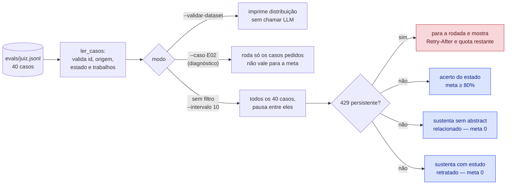
```mermaid
flowchart LR
    D[("evals/juiz.jsonl<br/>40 casos")] --> L["ler_casos:<br/>valida id, origem,<br/>estado e trabalhos"]
    L --> M{"modo"}
    M -- "--validar-dataset" --> V["imprime distribuição<br/>sem chamar LLM"]
    M -- "--caso E02<br/>(diagnóstico)" --> P["roda só os casos pedidos<br/>não vale para a meta"]
    M -- "sem filtro<br/>--intervalo 10" --> R["todos os 40 casos,<br/>pausa entre eles"]
    R --> Q{"429 persistente?"}
    Q -- sim --> STOP["para a rodada e mostra<br/>Retry-After e quota restante"]
    Q -- não --> C1["acerto do estado<br/>meta ≥ 80%"]
    Q -- não --> C2["sustenta sem abstract<br/>relacionado — meta 0"]
    Q -- não --> C3["sustenta com estudo<br/>retratado — meta 0"]

    classDef meta fill:#dbe4ff,stroke:#183FFF,color:#0b1f80
    classDef err fill:#f8d7da,stroke:#b02a37,color:#58151c
    class C1,C2,C3 meta
    class STOP err
```

#### Rodadas com o LLM real

Registradas em `specs/004-agente-juiz/tasks.md`. Cada mudança no prompt exige repetir o eval inteiro: o número de uma versão não vale para a seguinte.

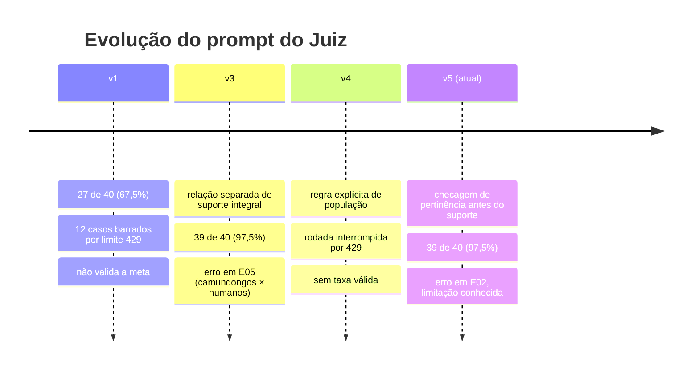
```mermaid
timeline
    title Evolução do prompt do Juiz
    v1 : 27 de 40 (67,5%) : 12 casos barrados por limite 429 : não valida a meta
    v3 : relação separada de suporte integral : 39 de 40 (97,5%) : erro em E05 (camundongos × humanos)
    v4 : regra explícita de população : rodada interrompida por 429 : sem taxa válida
    v5 (atual) : checagem de pertinência antes do suporte : 39 de 40 (97,5%) : erro em E02, limitação conhecida
```

| Métrica (v5, segundo o tasks.md) | Meta | Resultado |
| :--- | :--- | :--- |
| Acerto do estado | ≥ 80% | **97,5%** (39/40) |
| `sustenta` sem abstract relacionado | 0 | 0 nas rodadas v3 registradas; transcrever as linhas da v5 no PR |
| `sustenta` com estudo retratado | 0 | 0 nas rodadas v3 registradas; transcrever as linhas da v5 no PR |

O único erro da v5, o caso **E02**, responde `nada_encontrado` onde o rótulo é `exagera`: o modelo ainda trata um estudo pertinente como "sem estudo". É exatamente a fronteira que a etapa de relação tenta resolver.

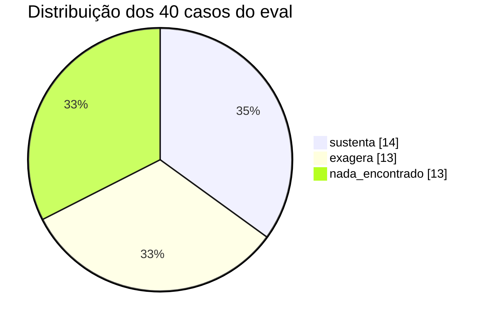
```mermaid
pie showData title Distribuição dos 40 casos do eval
    "sustenta" : 14
    "exagera" : 13
    "nada_encontrado" : 13
```

---

## 4. Como deve ficar com o Agente Pesquisador

> Esta seção segue o desenho da página [Arquitetura](/pages/arquitetura.md) (Triador → Pesquisador → Cache/OpenAlex → BERTopic → Juiz). **Nada disso está implementado ainda**; é a proposta de integração. Os pontos em aberto estão na seção 5.

### 4.1 Visão de contêineres alvo

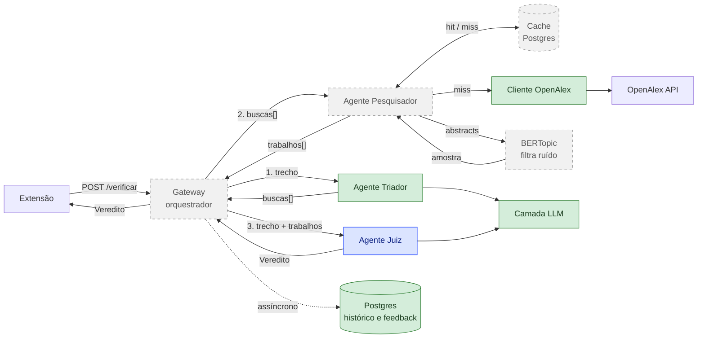
```mermaid
flowchart LR
    EXT["Extensão"] -->|"POST /verificar"| GW["Gateway<br/>orquestrador"]

    GW -->|"1. trecho"| TRI["Agente Triador"]
    TRI -->|"buscas[]"| GW
    GW -->|"2. buscas[]"| PES["Agente Pesquisador"]
    PES <-->|"hit / miss"| CACHE[("Cache<br/>Postgres")]
    PES -->|"miss"| OA["Cliente OpenAlex"]
    OA --> OAAPI["OpenAlex API"]
    PES -->|"abstracts"| BERT["BERTopic<br/>filtra ruído"]
    BERT -->|"amostra"| PES
    PES -->|"trabalhos[]"| GW
    GW -->|"3. trecho + trabalhos"| JUI["Agente Juiz"]
    JUI -->|"Veredito"| GW
    GW -->|"Veredito"| EXT
    GW -.->|"assíncrono"| PG[("Postgres<br/>histórico e feedback")]

    TRI --> LLM["Camada LLM"]
    JUI --> LLM

    classDef ok fill:#d4edda,stroke:#2e7d32,color:#1b3d1f
    classDef novo fill:#dbe4ff,stroke:#183FFF,color:#0b1f80
    classDef plano fill:#f1f1f1,stroke:#999,stroke-dasharray:5 5,color:#555
    class TRI,OA,LLM,PG ok
    class JUI novo
    class PES,CACHE,BERT,GW plano
```

### 4.2 Sequência completa alvo do `POST /verificar`

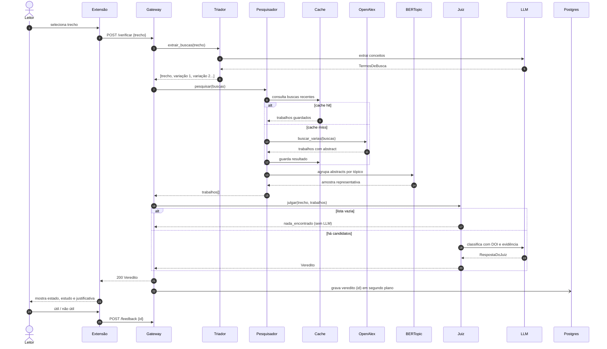
```mermaid
sequenceDiagram
    autonumber
    actor U as Leitor
    participant E as Extensão
    participant G as Gateway
    participant T as Triador
    participant P as Pesquisador
    participant K as Cache
    participant O as OpenAlex
    participant B as BERTopic
    participant J as Juiz
    participant L as LLM
    participant DB as Postgres

    U->>E: seleciona trecho
    E->>G: POST /verificar {trecho}
    G->>T: extrair_buscas(trecho)
    T->>L: extrai conceitos
    L-->>T: TermosDeBusca
    T-->>G: [trecho, variação 1, variação 2...]
    G->>P: pesquisar(buscas)
    P->>K: consulta buscas recentes
    alt cache hit
        K-->>P: trabalhos guardados
    else cache miss
        P->>O: buscar_varias(buscas)
        O-->>P: trabalhos com abstract
        P->>K: guarda resultado
    end
    P->>B: agrupa abstracts por tópico
    B-->>P: amostra representativa
    P-->>G: trabalhos[]
    G->>J: julgar(trecho, trabalhos)
    alt lista vazia
        J-->>G: nada_encontrado (sem LLM)
    else há candidatos
        J->>L: classifica com DOI e evidência
        L-->>J: RespostaDoJuiz
        J-->>G: Veredito
    end
    G-->>E: 200 Veredito
    G-)DB: grava veredito (id) em segundo plano
    E-->>U: mostra estado, estudo e justificativa
    U->>E: útil / não útil
    E->>G: POST /feedback {id}
```

### 4.3 Decisões do Pesquisador

O Pesquisador é **determinístico** (não usa LLM): decide de onde vêm os trabalhos e quantos seguem para o Juiz.

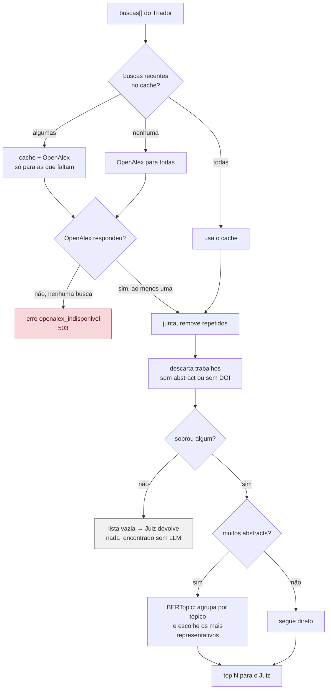
```mermaid
flowchart TD
    A["buscas[] do Triador"] --> B{"buscas recentes<br/>no cache?"}
    B -- "todas" --> C["usa o cache"]
    B -- "algumas" --> D["cache + OpenAlex<br/>só para as que faltam"]
    B -- "nenhuma" --> E["OpenAlex para todas"]
    D --> F
    E --> F{"OpenAlex respondeu?"}
    F -- "não, nenhuma busca" --> ERR["erro openalex_indisponivel<br/>503"]
    F -- "sim, ao menos uma" --> G["junta, remove repetidos"]
    C --> G
    G --> H["descarta trabalhos<br/>sem abstract ou sem DOI"]
    H --> I{"sobrou algum?"}
    I -- não --> V["lista vazia → Juiz devolve<br/>nada_encontrado sem LLM"]
    I -- sim --> J{"muitos abstracts?"}
    J -- sim --> K["BERTopic: agrupa por tópico<br/>e escolhe os mais<br/>representativos"]
    J -- não --> L["segue direto"]
    K --> M["top N para o Juiz"]
    L --> M

    classDef err fill:#f8d7da,stroke:#b02a37,color:#58151c
    classDef nd fill:#f1f1f1,stroke:#777,color:#333
    class ERR err
    class V nd
```

### 4.4 Antes × depois

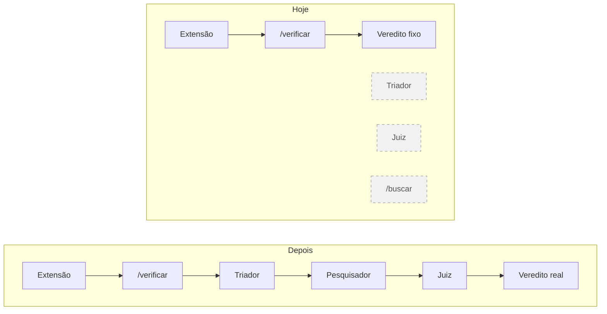
```mermaid
flowchart TB
    subgraph HOJE["Hoje"]
        direction LR
        h1["Extensão"] --> h2["/verificar"] --> h3["Veredito fixo"]
        h4["Triador"]:::solto
        h5["Juiz"]:::solto
        h6["/buscar"]:::solto
    end
    subgraph DEPOIS["Depois"]
        direction LR
        d1["Extensão"] --> d2["/verificar"] --> d3["Triador"] --> d4["Pesquisador"] --> d5["Juiz"] --> d6["Veredito real"]
    end
    HOJE ~~~ DEPOIS

    classDef solto fill:#f1f1f1,stroke:#999,stroke-dasharray:5 5,color:#555
```

### 4.5 Mapa de erros: do componente até a extensão

Todo erro chega à extensão no formato padronizado (`schemas/erro.py`). O mapeamento abaixo é a proposta para a esteira integrada.

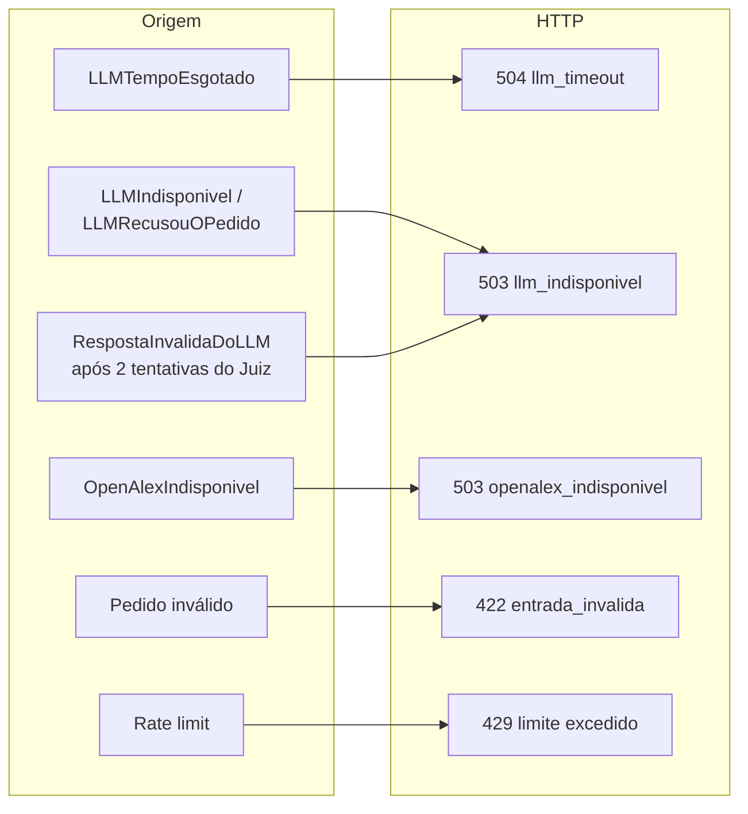
```mermaid
flowchart LR
    subgraph Origem
        e1["LLMTempoEsgotado"]
        e2["LLMIndisponivel /<br/>LLMRecusouOPedido"]
        e3["RespostaInvalidaDoLLM<br/>após 2 tentativas do Juiz"]
        e4["OpenAlexIndisponivel"]
        e5["Pedido inválido"]
        e6["Rate limit"]
    end
    subgraph HTTP
        r504["504 llm_timeout"]
        r503a["503 llm_indisponivel"]
        r503b["503 openalex_indisponivel"]
        r422["422 entrada_invalida"]
        r429["429 limite excedido"]
    end
    e1 --> r504
    e2 --> r503a
    e3 --> r503a
    e4 --> r503b
    e5 --> r422
    e6 --> r429
```

> O Triador **não** aparece no mapa de propósito: se o LLM falha nele, ele segue só com o trecho original e a esteira continua.

---

## 5. Pendências e pontos em aberto

```mermaid
timeline
    title Caminho até a esteira real
    Feature 019 (na main) : registrar as 3 taxas da v5 no PR ou na issue : fechar a issue #19
    Pesquisador : spec própria : cache de buscas : filtro de abstract e DOI
    BERTopic : decidir se entra agora ou depois : limite de N trabalhos para o Juiz
    Integração : /verificar chama Triador → Pesquisador → Juiz : persistir veredito com id : mapa de erros
```

| # | Ponto | Por que importa |
| :--- | :--- | :--- |
| 1 | **Registrar as métricas da v5** | O tasks.md cita 39/40, mas pede para transcrever no PR as linhas finais do runner, incluindo os dois erros inaceitáveis. Ainda está desmarcado. |
| 2 | Caso E02 erra na v5 | Limitação conhecida: `nada_encontrado` no lugar de `exagera`. |
| 3 | Dataset 100% sintético | Mede formato e lógica, não qualidade com estudos reais. |
| 4 | Teto de 600 caracteres | Provisório; confirmar com o tamanho do painel da extensão. |
| 5 | Quota do Groq | Várias rodadas pararam no 429; o eval completo precisa de `--intervalo` e pode bater na quota diária. |
| 6 | MCP × cliente HTTP direto | A Arquitetura cita um servidor MCP; a spec 002 implementou chamada REST direta. Definir qual vale. |
| 7 | Onde vive a orquestração | No Gateway (como no desenho) ou num serviço `esteira.py` separado, mais fácil de testar. |

Resolvidos pelos commits finais do PR #36: a justificativa não precisa mais citar o DOI, e a lista de palavras para reconhecer português passou de 18 para 30.
