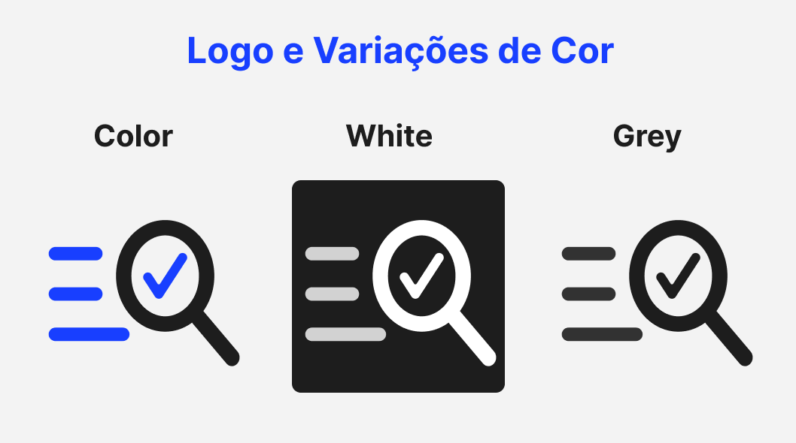
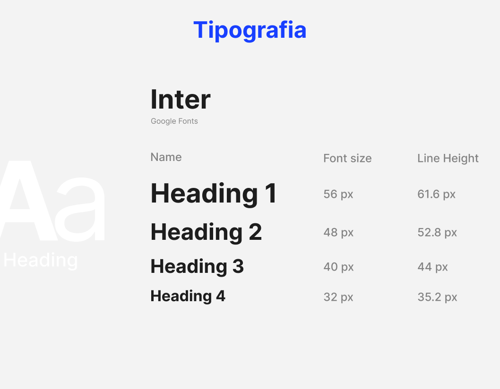
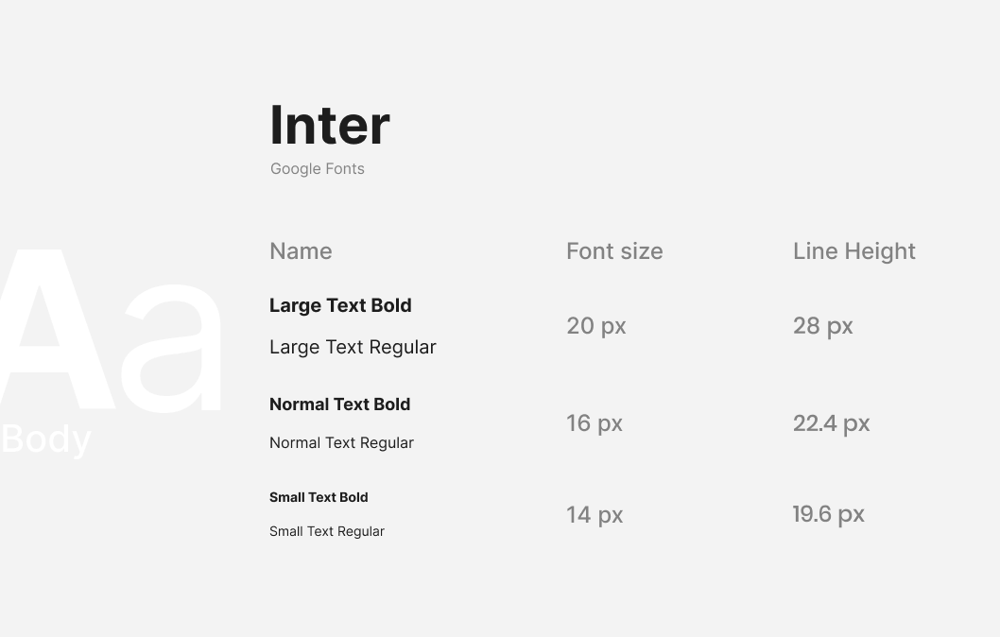
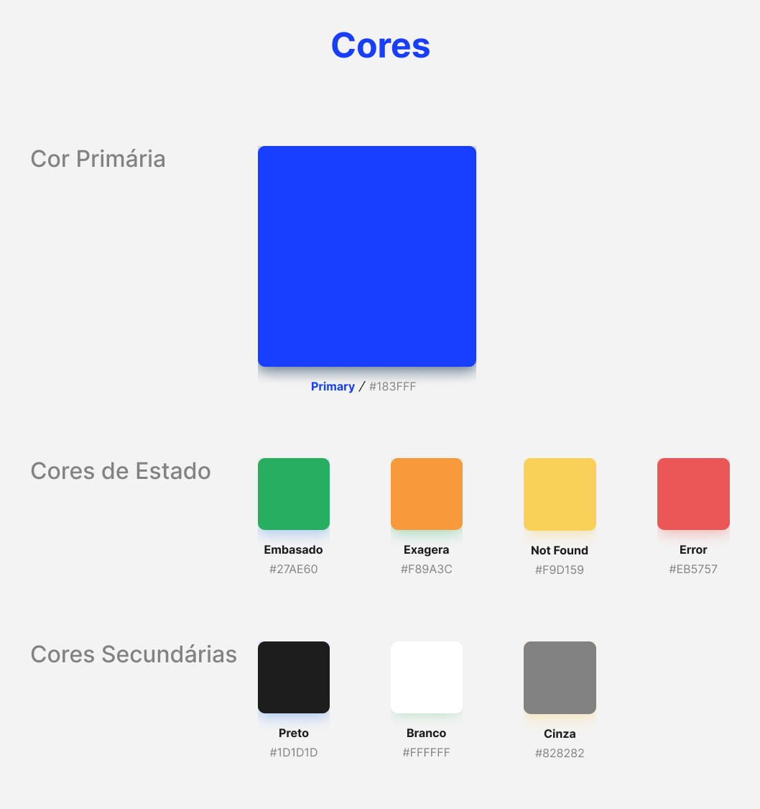

# Identidade Visual

O documento a seguir define os aspectos visuais para a implementação do Verificador Científico do grupo Arial 12, como logo, fontes e paleta de cores definidas para o produto.

A seguir o documento mostra o documento de Identidade Visual realizado no Figma, bem como o detalhamento dos elementos da Identidade Visual do Verificador.

<iframe style="border: 1px solid rgba(0, 0, 0, 0.1);" width="800" height="450" src="https://embed.figma.com/design/n8MpVevNfFrNI0JhYszpwy/prototype_arial12?node-id=2-1819&embed-host=share" allowfullscreen></iframe>

## Detalhamento da Identidade Visual

### Logo

A iconografia do logotipo do Verificador remete ao seu principal objetivo: validar alegações e citações científicas presentes em matérias da internet para o combate de desinformação. Visando ilustrar esse processo, o design combina blocos de texto sob uma lupa que destaca um símbolo de confirmação, traduzindo visualmente a ação de investigar e atestar a veracidade das fontes.

Para garantir flexibilidade e contraste nas diferentes telas e componentes do sistema, o logotipo possui três comportamentos de cor específicos:

### Tipografia

As fontes definidas para o Verificador Científico buscam alinhar a seriedade para a confiabilidade, agregando uma usabilidade intuitiva. Por isso, buscamos fontes simples e que passam a sensação de segurança e facilidade de leitura para os usuários.

Todos os textos do Verificador Científico devem utilizar a família tipográfica **Inter**, que garante alta legibilidade nas interfaces. A aplicação da fonte varia em diferentes pesos para estabelecer uma hierarquia visual clara entre títulos e textos corridos:

### Paleta de Cores

Para a paleta de cores do Verificador Científico, foram definidas  cores que compõem a identidade visual central e são utilizadas ao longo de toda a aplicação divididas em 3 grupos:

